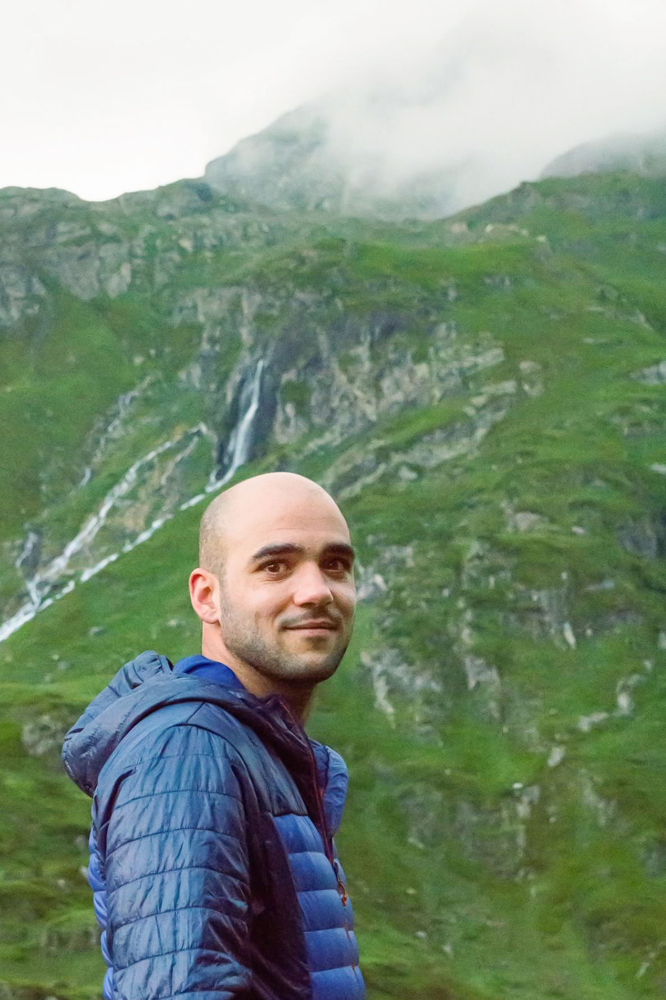

```{=html}
<div class="about-page">
  <div class="about-photo">
    
    <div class="social-links" style="margin-top: 1rem;">
      <a href="mailto:andres.romero_bravo@biol.lu.se" title="Email" aria-label="Email"><i class="bi bi-envelope"></i></a>
      <a href="https://portal.research.lu.se/en/persons/andr%C3%A9s-romero-bravo/" target="_blank" title="LU Research portal" aria-label="LU Research portal"><i class="bi bi-person-badge"></i></a>
      <a href="https://linkedin.com/in/aromerobravo" target="_blank" title="LinkedIn" aria-label="LinkedIn"><i class="bi bi-linkedin"></i></a>
      <a href="https://bsky.app/profile/a-romerobravo.bsky.social" target="_blank" title="Bluesky" aria-label="Bluesky"><i class="bi bi-bluesky"></i></a>
      <a href="https://spain.inaturalist.org/people/andresrb" target="_blank" title="iNaturalist" aria-label="iNaturalist"><i class="bi bi-leaf"></i></a>
      <a href="https://www.peakbagger.com/climber/ClimbListC.aspx?cid=53158&sort=AscentDate&u=m&j=-1&y=9999" target="_blank" title="Peakbagger" aria-label="Peakbagger"><i class="bi bi-triangle-fill"></i></a>
      <a href="https://github.com/andresarb" target="_blank" title="GitHub" aria-label="GitHub"><i class="bi bi-github"></i></a>
    </div>
  </div>
  <div class="about-text">
    <h1>Andres Romero Bravo</h1>
    <p class="subtitle">Plant evolutionary ecologist</p>
    <p>¡Hola! I am Andrés. I am originally from Madrid (Spain), where I lived most of my life and started my higher education with a degree in Teaching and a degree in Biology. My academic career has taken me to live in places like Torres del Paine (Chile), Lund (Sweden), where I obtained a MSc in Plant Science, and Lewes (UK), where I studied my PhD. I have recently returned to Lund to continue my career as a postdoctoral researcher.</p>
    <p>I am fascinated by floral evolution and plant–pollinator interactions and I study the ecological and evolutionary processes that affect the responses of flowering plants to environmental change. In my research, I combine quantitative genetics, phenotypic plasticity, and field and greenhouse experiments to understand how reproductive and vegetative traits respond to changes in abiotic and biotic environments.</p>
    <p>I conducted my PhD at the University of Sussex, within the <a href="https://www.sussex.ac.uk/lifesci/plant-evolutionary-ecology-lab/" target="_blank">Plant Evolutionary Ecology Lab</a>, investigating floral plasticity, evolvability, and local adaptation under novel pollination environments. My work here combined common-garden, transplant, and resurrection experiments with genomic and multivariate statistical analyses.</p>
    <p>Beyond research, I am a co-founder and Secretary of <a href="https://jxbe.weebly.com/" target="_blank">Jóvenes por la Botánica Española (JxBE)</a>, a society for young botanists in Spain focused on connecting young people interested in plants and fighting plant blindness.</p>
    <p>Growing up, and thanks to my parents, I developed an interest in exploring and studying nature. This soon grew into an ever-growing interest in <a href="https://www.peakbagger.com/climber/ClimbListC.aspx?cid=53158&sort=AscentDate&u=ft&j=-1&y=9999" target="_blank">mountaineering</a>, nature photography and science communication. I enjoy making the most of my background in education to bridge academia and the wider public, and in 2018, I started <a href="https://www.lanaturalezaaldetalle.com" target="_blank">La naturaleza al detalle</a>, a nature photography blog where I use nature photography to share my passion for the natural world with a broad audience.</p>
  </div>
</div>
```
