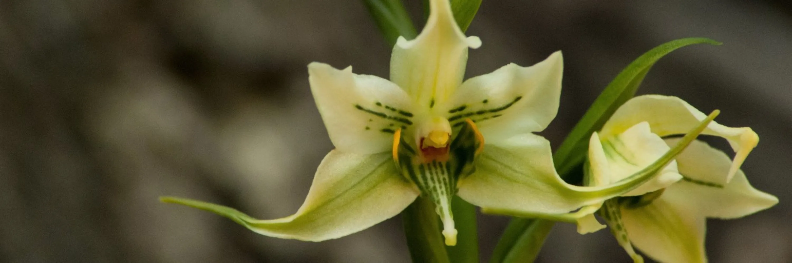

```{=html}
<!-- Slick carousel CSS -->
<link rel="stylesheet" href="https://cdnjs.cloudflare.com/ajax/libs/slick-carousel/1.8.1/slick.min.css"/>
<link rel="stylesheet" href="https://cdnjs.cloudflare.com/ajax/libs/slick-carousel/1.8.1/slick-theme.min.css"/>

<!-- Banner image with overlay -->
<div class="banner">
  
  <div class="banner-overlay">
    <p>Plant Evolutionary Biologist</p>
  </div>
</div>

<div class="page-content">
<!-- Home layout: about + spacer + carousel -->
<div class="home-layout">
  <div class="about-section">
    <div class="about-photo">
      
    </div>
    <div class="about-text">
      <p>Hi! I am a plant evolutionary biologist working on floral evolution,
      plant–pollinator interactions, and plant adaptation to environmental change.</p>
      <p>
        <a href="about.html">More about me</a> ·
        <a href="research.html">My research</a> ·
        <a href="cv.html">CV</a> ·
        <a href="publications.html">Publications</a>
      </p>
      <div class="social-links">
        <a href="mailto:andres.romero_bravo@biol.lu.se" title="Email" aria-label="Email"><i class="bi bi-envelope"></i></a>
        <a href="https://portal.research.lu.se/en/persons/andr%C3%A9s-romero-bravo/" target="_blank" title="Lund University profile" aria-label="Lund University profile"><i class="bi bi-person-badge"></i></a>
        <a href="https://linkedin.com/in/aromerobravo" target="_blank" title="LinkedIn" aria-label="LinkedIn"><i class="bi bi-linkedin"></i></a>
        <a href="https://bsky.app/profile/a-romerobravo.bsky.social" target="_blank" title="Bluesky" aria-label="Bluesky"><i class="bi bi-bluesky"></i></a>
        <a href="https://spain.inaturalist.org/people/andresrb" target="_blank" title="iNaturalist" aria-label="iNaturalist"><i class="bi bi-leaf"></i></a>
        <a href="https://www.peakbagger.com/climber/ClimbListC.aspx?cid=53158&sort=AscentDate&u=m&j=-1&y=9999" target="_blank" title="Peakbagger" aria-label="Peakbagger"><i class="bi bi-triangle-fill"></i></a>
        <a href="https://github.com/andresarb" target="_blank" title="GitHub" aria-label="GitHub"><i class="bi bi-github"></i></a>
      </div>
    </div>
  </div>

  <!-- Spacer -->
  <div class="home-spacer"></div>

  <!-- Carousel -->
  <div class="home-carousel">
```

```{r}
#| results: asis
imgs <- list.files("images/carousel", full.names = FALSE)
cat('<div class="slick-carousel-wrapper">\n')
cat('<div class="slick-carousel">\n')
for (i in seq_along(imgs)) {
  cat(paste0('<div><a href="images/carousel/', imgs[i], '" class="lightbox-link"></a></div>\n'))
}
cat('</div>\n')
cat('</div>\n')
```

```{=html}
  </div>
</div>
</div>
```

```{=html}
<div class="page-content">
<!-- Contact -->
<div class="contact-section">
  <h2>Contact</h2>
  <p>📧 <a href="mailto:andres.romero_bravo@biol.lu.se">andres.romero_bravo@biol.lu.se</a> / <a href="mailto:aromerobravo@gmail.com">aromerobravo@gmail.com</a></p>
  <p>🏛️ Department of Biology, Lund University<br>
  Ecologihuset, Kontaktvägen 10, 22362 Lund, Sweden</p>
</div>
</div>

<!-- Lightbox overlay -->
<div id="lightbox" class="lightbox-overlay" onclick="this.style.display='none'">
  
</div>

<!-- jQuery and Slick JS -->
<script src="https://cdnjs.cloudflare.com/ajax/libs/jquery/3.3.1/jquery.min.js"></script>
<script src="https://cdnjs.cloudflare.com/ajax/libs/slick-carousel/1.8.1/slick.min.js"></script>
<script>
$(document).ready(function(){
  var $carousel = $('.slick-carousel');
  var $slides = $carousel.children('div');
  var shuffled = $slides.toArray().sort(function(){ return Math.random() - 0.5; });
  $carousel.empty().append(shuffled);
  $carousel.slick({
    centerMode: true,
    centerPadding: '120px',
    slidesToShow: 1,
    autoplay: true,
    autoplaySpeed: 4000,
    arrows: false,
    dots: true,
    infinite: true,
    adaptiveHeight: false,
    initialSlide: 1
  });
  // Lightbox
  $(document).on('click', '.lightbox-link', function(e){
    e.preventDefault();
    var src = $(this).attr('href');
    $('#lightbox-img').attr('src', src);
    $('#lightbox').fadeIn();
  });
});
</script>
```
